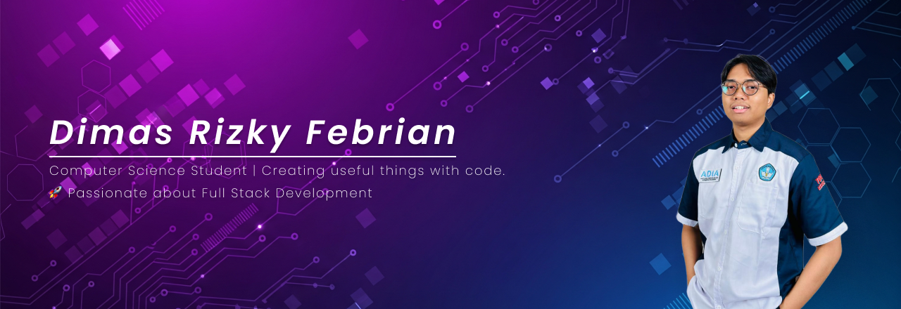

<h1 align="left">Hi, I'm Dimas 👋</h1>

###

I'm Dimas Rizky Febrian, a Backend Engineer from Indonesia 🇮🇩, focused on building reliable, event-driven systems with Go and NestJS.

###

<h2 align="left">About me</h2>

###

💼 Currently freelancing as a Backend Engineer on an HRIS enhancement project for a state-owned enterprise 
🛠️ Core stack: Go · NestJS · PostgreSQL · Redis · Apache Kafka · Docker · GCP 
📄 Portfolio: <a href="#" target="_blank">View on Google Drive</a> 
📫 Reach me: dimasrfebrian@gmail.com

###

<h2 align="left">Core stack</h2>

###

  
  
  
  
  
  
  
  
  
  
  
  
  
  
  
  
  

###

<h2 align="left">Connect with me</h2>

###

  
  

###

<h2 align="left">My GitHub stats</h2>

###

  
  
  

###

###
